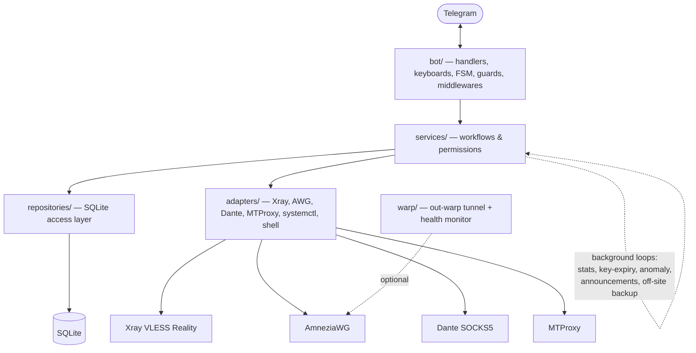

# VPN Telegram Bot

Telegram bot for self-hosted VPN access management on an Ubuntu VDS. The bot manages users,
access approval, Xray VLESS Reality keys, AmneziaWG keys, Hysteria2 keys, key
revocation/deletion, SOCKS5 and MTProto proxy access, audit records, and basic traffic
statistics — designed for a single-server deployment without Docker, Redis, PostgreSQL,
or a heavy ORM.

🇷🇺 Russian version: [README_RU.md](README_RU.md)

## Screenshots

| Admin panel | Key issuance |
|---|---|
|  |  |

| Proxy section | WARP tunnel |
|---|---|
|  |  |

> Screenshots live in [`docs/images/`](docs/images/README.md).

## Contents

- [Quick Start](#quick-start)
- [Features](#features)
- [Architecture](#architecture)
- [Stack & Prerequisites](#stack--prerequisites)
- [Repository Layout](#repository-layout)
- [Security Warning](#security-warning)
- [Configuration](#configuration)
- [Deployment](#deployment)
- [Access Lifecycle Policy](#access-lifecycle-policy)
- [Backend Degraded Mode](#backend-degraded-mode)
- [Development](#development)
- [Database](#database)
- [Documentation](#documentation)
- [Project Status](#project-status)
- [License](#license)

## Quick Start

Minimal run for evaluation (only `BOT_TOKEN` and `ADMIN_IDS` are required to start):

```bash
git clone https://github.com/Egor051/vpnbot.git
cd vpnbot
python3 -m venv .venv && . .venv/bin/activate
pip install -r requirements.txt -c constraints.txt
cp .env.example .env
# Edit .env: set BOT_TOKEN (from BotFather) and ADMIN_IDS (your numeric Telegram ID).
python main.py
```

The bot starts in private-chat mode and accepts the admin(s) immediately. To actually issue
keys you also need a configured Xray and/or AmneziaWG backend on the server — see
[Configuration](#configuration) and the [Deployment guide](docs/deployment.md). For production,
follow the [Deployment](#deployment) section rather than this evaluation flow.

## Features

- Telegram user registration and access approval flow.
- Admin panel for pending requests, users, key issuance, audit, stats, and announcements.
- Xray VLESS Reality key creation, config delivery, revocation, deletion, and startup reconciliation.
- AmneziaWG key creation, client config delivery, revocation, deletion, IP allocation, and startup reconciliation.
- Hysteria2 (apernet v2) key creation, link delivery, revocation, and deletion with **no data-plane restart**: a standalone `hy2_auth` HTTP endpoint authenticates handshakes against the live database, so revokes take effect on the next handshake. Disabled by default — see [Deployment](docs/deployment.md).
- Separate one-page Telegram section "Прокси" for SOCKS5/Dante auto-issue and Telegram MTProto Proxy links.
- MTProto supports `static` compatibility mode and `managed` mode with per-user secrets, safe apply, and rollback.
- Optional WARP outbound-IP masking module: server-side AmneziaWG (`out-warp`) tunnel that hides the server's outbound IP for selected "spy" apps, with automatic health-based fallback. Disabled by default — see [WARP](docs/warp.md).
- Ownership checks so users can view their own configs/stats; proxy (SOCKS5/MTProto) revoke/delete are admin-only, while VPN key (Xray/AWG/Hysteria2) revoke/delete are available to the key owner and to admins.
- Audit log with recursive masking for sensitive values.
- SQLite storage with migrations from `db/schema.sql`, rotating local logs, and a systemd deployment unit.
- Background workers: key-expiry checks, traffic-stats sampling, anomaly detection, scheduled announcements, and encrypted off-site backups.

## Architecture

The bot is a single asyncio process (`main.py`) layered as Telegram handlers → business
services → SQLite repositories and backend adapters, plus a self-contained WARP module and a
set of background loops.



- `bot/` parses updates, enforces guards (admin-only actions, private-chat-only), and renders keyboards/FSM flows.
- `services/` holds the workflows (access approval, key lifecycle, proxy issuance, backend health, etc.) and the permission checks.
- `repositories/` is the only layer that touches SQLite; `adapters/` is the only layer that touches Xray/AWG/Dante/MTProxy/systemd, going through sudo helpers in non-root mode.
- `warp/` is an optional, self-contained module (tunnel, routes, split, health monitor).
- In non-root deployments, privileged backend mutations are isolated behind fixed sudo helpers — see [Privilege Separation](docs/security/privilege-separation-plan.md).

## Stack & Prerequisites

**Stack:** Python 3.12 · aiogram 3 · SQLite (aiosqlite) · python-dotenv · systemd ·
Xray VLESS Reality · AmneziaWG / WireGuard-compatible tooling.

**Prerequisites:**

- Ubuntu / Linux VDS.
- **Python 3.12** (the only supported runtime; dependency pinning targets 3.12.x).
- A Telegram bot token from BotFather and your numeric admin user ID(s).
- For VPN keys: an existing **Xray** (VLESS Reality) and/or **AmneziaWG** installation on the server.
- For proxy backends (optional): **Dante** (SOCKS5) and/or **MTProxy** already installed and listening — the bot manages access, not installation.

## Repository Layout

```text
main.py                    # Bot entry point
init_db.py                 # SQLite schema bootstrap/migration entry point
requirements.txt           # Runtime dependencies
constraints.txt            # Pinned production dependency constraints
.env.example               # Environment variable template
db/schema.sql              # Database schema
deploy/vpn-bot.service     # vpn-bot systemd unit template
deploy/run-mtproxy-managed # MTProxy managed-mode wrapper installed during deploy
bot/                       # Telegram handlers, keyboards, FSM, formatting
services/                  # Business workflows and permissions
repositories/              # SQLite access layer
adapters/                  # Xray, AWG, systemctl, backups, shell adapters
warp/                      # WARP outbound-IP masking module (tunnel, routes, health monitor)
scripts/                   # vpn-bot-warp-* sudo helpers
config/settings.py         # Environment parsing and validation
tests/                     # Regression and hardening tests
docs/                      # Configuration, deployment, operations, WARP, proxy docs
```

## Security Warning

This project handles operational VPN and Telegram secrets. Never commit or publish:

- `.env` files, Telegram bot tokens, private/preshared keys.
- Real Xray Reality or AmneziaWG server/client configuration, or full VPN client configs.
- SQLite databases or dumps.
- Server IP addresses combined with credentials, or SSH/panel/hosting credentials.

Use `.env.example` only as a template. Keep production configuration on the server and outside
Git history. **Recommended BotFather setting:** disable adding this bot to groups — it is
designed for private chats only; group chats may expose user data, admin actions, or sensitive
operational messages.

## Configuration

Copy `.env.example` to `.env` and replace placeholders with values for your server. Only
`BOT_TOKEN` and `ADMIN_IDS` are required to start; fill the relevant Xray or AWG values before
issuing that key type.

| Variable | Required | Purpose |
|---|---|---|
| `BOT_TOKEN` | **Yes** | Telegram Bot API token from BotFather. 🔒 |
| `ADMIN_IDS` | **Yes** | Comma-separated Telegram user IDs with admin access. |
| `BOT_LANGUAGE` | No (`ru`) | Bot UI language: `ru` or `en`. |
| `SQLITE_SYNCHRONOUS` | No (`FULL`) | SQLite durability mode; `FULL` is the safe control-plane default. |
| `XRAY_PUBLIC_HOST`, `XRAY_REALITY_PUBLIC_KEY`, `XRAY_SNI`, `XRAY_SHORT_ID` | For Xray keys | Reality connection parameters clients need. |
| `AWG_ENDPOINT_HOST`, `AWG_ENDPOINT_PORT`, `AWG_SERVER_PUBLIC_KEY` | For AWG keys | Public AmneziaWG endpoint shown in client configs. |

📖 **Every variable** (defaults, ranges, security notes, legacy aliases) is documented in
**[docs/configuration.md](docs/configuration.md)**. The copy-paste template with inline comments
is **[`.env.example`](.env.example)**.

## Deployment

The supplied systemd unit (`deploy/vpn-bot.service`) expects the project in `/opt/vpn-service`.
Two deployment models are supported:

- **Root deployment (current default — `XRAY_APPLY_MODE=api`, `User=root`).** Adds/removes Xray keys without restarting Xray, so no connections drop. No sudo helpers needed.
- **Non-root deployment (privilege-helper mode, `User=vpn-bot`).** Hardened: every privileged backend change goes through fixed sudo helpers. Use `XRAY_APPLY_MODE=restart`/`reload` here.

> ⚠️ **`XRAY_APPLY_MODE=api` requires root and is incompatible with `PRIVILEGE_HELPERS_ENABLED=true`.**
> The bot refuses to start if both are set. `deploy/vpn-bot.service` is the authoritative source —
> every deploy overwrites the system unit from it, so switch models by editing the repo file, not
> the installed one. Full rationale and one-time Xray setup: **[docs/deployment.md](docs/deployment.md)**.

Step-by-step install (both models), the one-time Xray API setup, the post-deploy smoke
checklist, and day-2 operations live in:

- **[docs/deployment.md](docs/deployment.md)** — install, both models, Xray API mode.
- **[docs/operations.md](docs/operations.md)** — runbook: health checks, backup/restore, degraded recovery, rollback.

## Access Lifecycle Policy

- Approved users may create their own Xray/AWG/Hysteria2 keys, view their own active configs and stats, and edit their own key notes.
- Approved users may issue and view their own SOCKS5/MTProto proxy access when the backend is enabled.
- Revoke/delete of **VPN keys (Xray/AWG/Hysteria2)** is available **to the key owner and to admins**: the owner sees revoke/delete buttons for their own keys, and direct callbacks/service calls verify ownership (another user's key is rejected). Revoke/delete of **proxy access (SOCKS5/MTProto)** is **admin-only**.
- Blocking a user is an admin action: it blocks bot access and attempts to revoke active/problem VPN keys and proxy access.
- In `MTPROTO_MODE=static`, blocking/revoking only deactivates the bot/SQLite record; a copied shared secret keeps working until the shared secret is rotated. In `MTPROTO_MODE=managed`, admin revoke removes that user's secret from the managed active list while other users remain active.

## Backend Degraded Mode

The bot marks a backend DEGRADED when reconciliation cannot prove that SQLite and the server
runtime are safe to mutate automatically. DEGRADED is backend-specific — e.g. Xray DEGRADED
blocks only Xray create/revoke/delete; other backends keep working unless they are also
DEGRADED. The admin panel's `Диагностика backend` shows `OK`/`DEGRADED` per backend with a
non-secret reason. Recovery procedures for each backend are in
[docs/operations.md](docs/operations.md#degraded-recovery).

## Development

Install runtime and dev dependencies, then run the same gates as CI:

```bash
python -m pip install -r requirements.txt -c constraints.txt
python -m pip install -r requirements-dev.txt

make audit                 # pip-audit over requirements + constraints
python -m ruff check .
python -m compileall .
python -m mypy --strict bot/ services/ adapters/ config/ models/ utils/ repositories/ main.py init_db.py
python -m pytest --cov=. --cov-report=term-missing --cov-fail-under=60
```

GitHub Actions runs these gates without production secrets or live services. Contribution
workflow, dependency-update process (`make update-hashes`), and coding conventions are in
[CONTRIBUTING.md](CONTRIBUTING.md).

## Database

SQLite is the local storage backend; the default path is `/opt/vpn-service/data/vpn.db`.
`init_db.py` applies schema bootstrap/migrations, and the bot also bootstraps the database on
startup. Current tables:

`users`, `access_requests`, `vpn_keys`, `trial_key_requests`, `proxy_entries`,
`proxy_accesses`, `audit_log`, `vpn_key_traffic_stats`, `deleted_key_traffic_archive`,
`announcement_batches`, `announcement_deliveries`, `protocol_modules`, `warp_settings`,
`server_status_settings`, `maintenance_settings` (`schema_meta` tracks the applied
schema version internally).

## Documentation

| Document | What's inside |
|---|---|
| [docs/configuration.md](docs/configuration.md) | Complete environment-variable reference (all backends, WARP, legacy aliases). |
| [docs/deployment.md](docs/deployment.md) | Install steps for both models, Xray API mode, one-time server setup, smoke checklist. |
| [docs/operations.md](docs/operations.md) | Production runbook: health checks, backup/restore, degraded recovery, rollback, manual verification. |
| [docs/proxy.md](docs/proxy.md) | SOCKS5/Dante and MTProto (static + managed) deployment and recovery. |
| [docs/warp.md](docs/warp.md) | WARP outbound-IP masking: config format, install, proxy egress, selective-split. |
| [docs/xray-xhttp-inbound.md](docs/xray-xhttp-inbound.md) | One-time server-side setup for the VLESS (HTTP) / XHTTP transport. |
| [docs/security/privilege-separation-plan.md](docs/security/privilege-separation-plan.md) | Non-root privilege-separation architecture and helper contracts. |

Russian mirrors are available as `*.ru.md` next to each document.

## Project Status

Early self-hosted project. It is usable as a focused VPN management bot, but production use
requires careful review, server-specific testing, operational backups, secret-handling
discipline, and hardening of the surrounding Xray/AWG/server setup.

## License

MIT License. See [LICENSE](LICENSE).

Third-party runtime dependencies retain their own licenses (all permissive —
MIT / Apache-2.0 / BSD / MPL-2.0 / PSF — and compatible with MIT distribution).
