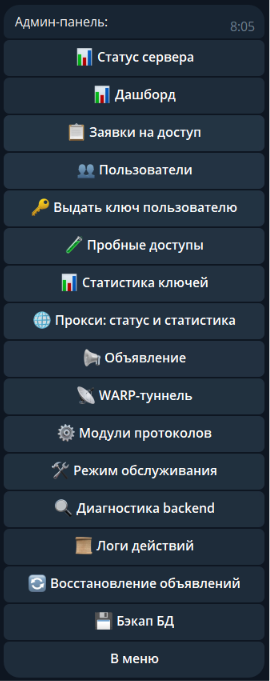
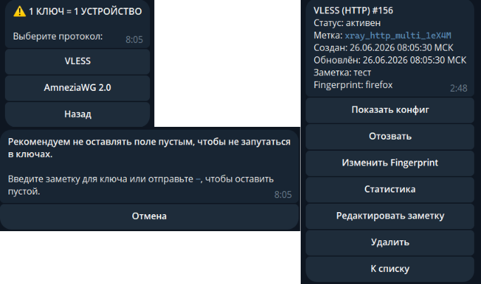
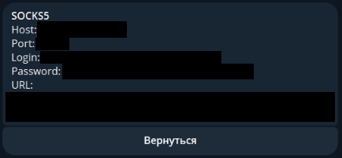
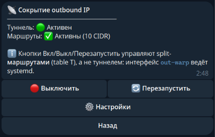
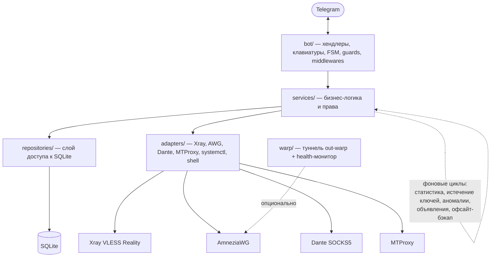

# VPN Telegram Bot

Telegram-бот для управления доступом к self-hosted VPN на Ubuntu VDS. Бот управляет
пользователями, одобрением заявок, ключами Xray VLESS Reality, ключами AmneziaWG,
ключами Hysteria2, отзывом/удалением ключей, доступом к прокси SOCKS5 и MTProto, записями
аудита и базовой статистикой трафика — рассчитан на развёртывание на одном сервере без
Docker, Redis, PostgreSQL и тяжёлых ORM.

🇬🇧 English version: [README.md](README.md)

## Скриншоты

| Панель администратора | Выдача ключа |
|---|---|
|  |  |

| Раздел «Прокси» | WARP-туннель |
|---|---|
|  |  |

> Скриншоты лежат в [`docs/images/`](docs/images/README.md).

## Содержание

- [Быстрый старт](#быстрый-старт)
- [Возможности](#возможности)
- [Архитектура](#архитектура)
- [Стек и требования](#стек-и-требования)
- [Структура репозитория](#структура-репозитория)
- [Предупреждение о безопасности](#предупреждение-о-безопасности)
- [Конфигурация](#конфигурация)
- [Развёртывание](#развёртывание)
- [Политика жизненного цикла доступа](#политика-жизненного-цикла-доступа)
- [Backend Degraded Mode](#backend-degraded-mode)
- [Разработка](#разработка)
- [База данных](#база-данных)
- [Документация](#документация)
- [Статус проекта](#статус-проекта)
- [Лицензия](#лицензия)

## Быстрый старт

Минимальный запуск для ознакомления (для старта обязательны только `BOT_TOKEN` и `ADMIN_IDS`):

```bash
git clone https://github.com/Egor051/vpnbot.git
cd vpnbot
python3 -m venv .venv && . .venv/bin/activate
pip install -r requirements.txt -c constraints.txt
cp .env.example .env
# Отредактируйте .env: задайте BOT_TOKEN (из BotFather) и ADMIN_IDS (ваш числовой Telegram ID).
python main.py
```

Бот стартует в режиме личных чатов и сразу принимает администратора(ов). Чтобы реально
выдавать ключи, на сервере также нужен настроенный backend Xray и/или AmneziaWG — см.
[Конфигурация](#конфигурация) и [гайд по развёртыванию](docs/deployment.ru.md). Для production
следуйте разделу [Развёртывание](#развёртывание), а не этому ознакомительному сценарию.

## Возможности

- Регистрация пользователей в Telegram и процесс одобрения доступа.
- Панель администратора: заявки, пользователи, выдача ключей, аудит, статистика, объявления.
- Создание ключей Xray VLESS Reality, доставка конфигурации, отзыв, удаление и сверка при запуске.
- Создание ключей AmneziaWG, доставка конфигурации клиента, отзыв, удаление, выделение IP и сверка при запуске.
- Создание ключей Hysteria2 (apernet v2), доставка ссылки, отзыв и удаление **без перезапуска data plane**: отдельный HTTP-эндпоинт `hy2_auth` авторизует handshake'и по живой базе, поэтому отзыв вступает в силу на следующем handshake. По умолчанию выключено — см. [Развёртывание](docs/deployment.md).
- Отдельный раздел «Прокси» в Telegram для автоматической выдачи SOCKS5/Dante и ссылок Telegram MTProto Proxy.
- MTProto поддерживает режим совместимости `static` и режим `managed` с персональными секретами, safe apply и rollback.
- Опциональный модуль WARP-сокрытия исходящего IP: серверный AmneziaWG-туннель (`out-warp`), скрывающий outbound IP сервера для выбранных «приложений-шпионов», с автоматическим health-based fallback. Выключен по умолчанию — см. [WARP](docs/warp.ru.md).
- Проверки владельца: пользователи видят свои конфигурации и статистику; деструктивные операции с VPN и прокси — только для администраторов.
- Audit log с рекурсивной маскировкой чувствительных значений.
- Хранилище SQLite с миграциями из `db/schema.sql`, ротируемые локальные логи и развёртывание через systemd.
- Фоновые задачи: проверка истечения ключей, сбор статистики трафика, обнаружение аномалий, плановые объявления, зашифрованные офсайтовые бэкапы.

## Архитектура

Бот — это единый asyncio-процесс (`main.py`), разбитый на слои: Telegram-хендлеры →
бизнес-сервисы → SQLite-репозитории и адаптеры бэкендов, плюс самодостаточный модуль WARP и
набор фоновых циклов.



- `bot/` разбирает апдейты, применяет guards (admin-only действия, только личные чаты) и рисует клавиатуры/FSM-флоу.
- `services/` содержит бизнес-логику (одобрение доступа, жизненный цикл ключей, выдача прокси, health бэкендов и т.д.) и проверки прав.
- `repositories/` — единственный слой, который трогает SQLite; `adapters/` — единственный, который трогает Xray/AWG/Dante/MTProxy/systemd, в non-root режиме через sudo-хелперы.
- `warp/` — опциональный самодостаточный модуль (туннель, маршруты, split, health-монитор).
- В non-root развёртываниях привилегированные операции изолированы за фиксированными sudo-хелперами — см. [Privilege Separation](docs/security/privilege-separation-plan.ru.md).

## Стек и требования

**Стек:** Python 3.12 · aiogram 3 · SQLite (aiosqlite) · python-dotenv · systemd ·
Xray VLESS Reality · AmneziaWG / WireGuard-совместимые инструменты.

**Требования:**

- Ubuntu / Linux VDS.
- **Python 3.12** (единственный поддерживаемый runtime; пиннинг зависимостей рассчитан на 3.12.x).
- Токен Telegram-бота из BotFather и ваш числовой admin user ID.
- Для VPN-ключей: установленный на сервере **Xray** (VLESS Reality) и/или **AmneziaWG**.
- Для прокси-бэкендов (опционально): уже установленные и слушающие **Dante** (SOCKS5) и/или **MTProxy** — бот управляет доступом, а не установкой.

## Структура репозитория

```text
main.py                    # Точка входа бота
init_db.py                 # Инициализация/миграция схемы SQLite
requirements.txt           # Runtime-зависимости
constraints.txt            # Зафиксированные версии зависимостей для production
.env.example               # Шаблон переменных окружения
db/schema.sql              # Схема базы данных
deploy/vpn-bot.service     # Шаблон systemd-юнита vpn-bot
deploy/run-mtproxy-managed # Wrapper MTProxy для managed-режима, устанавливается при деплое
bot/                       # Telegram handlers, keyboards, FSM, форматирование
services/                  # Бизнес-логика и управление правами доступа
repositories/              # Слой доступа к SQLite
adapters/                  # Адаптеры для Xray, AWG, systemctl, backup, shell
warp/                      # Модуль WARP-сокрытия исходящего IP (туннель, маршруты, health-монитор)
scripts/                   # sudo-хелперы vpnbot-warp-*
config/settings.py         # Разбор переменных окружения и валидация
tests/                     # Регрессионные тесты и hardening-тесты
docs/                      # Документация: конфигурация, развёртывание, эксплуатация, WARP, прокси
```

## Предупреждение о безопасности

Проект работает с VPN-ключами и секретами Telegram. Никогда не коммитьте и не публикуйте:

- Файлы `.env`, токены Telegram-бота, приватные/preshared ключи.
- Реальную конфигурацию сервера/клиента Xray Reality или AmneziaWG, полные конфигурации VPN-клиентов.
- Базы данных SQLite или их дампы.
- IP-адреса серверов в сочетании с credentials, доступы SSH/панелей/хостинга.

Используйте `.env.example` только как шаблон. Храните production-конфигурацию на сервере, вне
истории Git. **Рекомендуемая настройка BotFather:** отключите добавление бота в группы — он
рассчитан только на личные чаты; групповые чаты могут раскрыть данные пользователей, действия
администраторов или конфиденциальные сообщения.

## Конфигурация

Скопируйте `.env.example` в `.env` и замените placeholder'ы значениями для вашего сервера. Для
запуска обязательны только `BOT_TOKEN` и `ADMIN_IDS`; заполните соответствующие поля Xray или
AWG перед выдачей ключей нужного типа.

| Переменная | Обязательна | Назначение |
|---|---|---|
| `BOT_TOKEN` | **Да** | Токен Telegram Bot API из BotFather. 🔒 |
| `ADMIN_IDS` | **Да** | Telegram user ID администраторов через запятую. |
| `BOT_LANGUAGE` | Нет (`ru`) | Язык UI бота: `ru` или `en`. |
| `SQLITE_SYNCHRONOUS` | Нет (`FULL`) | Режим надёжности SQLite; `FULL` — безопасный дефолт для control-plane. |
| `XRAY_PUBLIC_HOST`, `XRAY_REALITY_PUBLIC_KEY`, `XRAY_SNI`, `XRAY_SHORT_ID` | Для Xray-ключей | Параметры Reality, нужные клиентам. |
| `AWG_ENDPOINT_HOST`, `AWG_ENDPOINT_PORT`, `AWG_SERVER_PUBLIC_KEY` | Для AWG-ключей | Публичный AmneziaWG endpoint в клиентских конфигах. |

📖 **Все переменные** (значения по умолчанию, диапазоны, security-заметки, legacy-aliases)
описаны в **[docs/configuration.ru.md](docs/configuration.ru.md)**. Шаблон для копирования с
комментариями — **[`.env.example`](.env.example)**.

## Развёртывание

Поставляемый systemd-юнит (`deploy/vpn-bot.service`) ожидает проект в `/opt/vpn-service`.
Поддерживаются две модели развёртывания:

- **Root-развёртывание (текущий дефолт — `XRAY_APPLY_MODE=api`, `User=root`).** Добавляет/удаляет ключи Xray без перезапуска сервиса, соединения не обрываются. Sudo-хелперы не нужны.
- **Non-root развёртывание (privilege-helper mode, `User=vpn-bot`).** Усиленная модель: каждое привилегированное изменение бэкенда идёт через фиксированные sudo-хелперы. Здесь используйте `XRAY_APPLY_MODE=restart`/`reload`.

> ⚠️ **`XRAY_APPLY_MODE=api` требует root и несовместим с `PRIVILEGE_HELPERS_ENABLED=true`.**
> Бот откажет в запуске, если заданы оба. `deploy/vpn-bot.service` — авторитетный источник:
> каждый деплой перезаписывает системный юнит из него, поэтому модель меняют правкой файла в
> репозитории, а не установленного. Полное обоснование и разовая настройка Xray:
> **[docs/deployment.ru.md](docs/deployment.ru.md)**.

Пошаговая установка (обе модели), разовая настройка Xray API, smoke-чеклист после деплоя и
эксплуатация описаны в:

- **[docs/deployment.ru.md](docs/deployment.ru.md)** — установка, обе модели, Xray API mode.
- **[docs/operations.ru.md](docs/operations.ru.md)** — runbook: health-проверки, backup/restore, восстановление из degraded, rollback.

## Политика жизненного цикла доступа

- Одобренные пользователи могут создавать свои ключи Xray/AWG/Hysteria2, просматривать свои активные конфигурации и статистику, редактировать заметки к своим ключам.
- Одобренные пользователи могут получать и просматривать свой SOCKS5/MTProto proxy access при включённом backend.
- Revoke/delete **VPN-ключей** (Xray/AWG/Hysteria2) доступны **владельцу ключа и администратору**: владелец видит кнопки отзыва/удаления в разделе своих ключей, а прямые callback/service-вызовы проверяют владение (чужой ключ отклоняется). Revoke/delete **proxy-доступа** (SOCKS5/MTProto) — **только для администраторов**.
- Блокировка пользователя — действие администратора: блокирует доступ к боту и пытается отозвать активные/проблемные VPN-ключи и proxy access.
- В `MTPROTO_MODE=static` блокировка/отзыв только деактивирует запись в боте/SQLite; скопированный общий секрет работает до ротации. В `MTPROTO_MODE=managed` admin revoke удаляет секрет этого пользователя из managed active list, не затрагивая других.

## Backend Degraded Mode

Бот помечает backend как DEGRADED, когда сверка не может подтвердить, что SQLite и серверный
runtime безопасно изменять автоматически. DEGRADED специфичен для каждого backend — например,
Xray DEGRADED блокирует только Xray create/revoke/delete; остальные бэкенды продолжают работать,
если они не DEGRADED. В панели администратора раздел `Диагностика backend` показывает
`OK`/`DEGRADED` по каждому бэкенду с причиной без секретов. Процедуры восстановления по каждому
бэкенду — в [docs/operations.ru.md](docs/operations.ru.md#восстановление-из-degraded).

## Разработка

Установите runtime и dev-зависимости и запустите те же проверки, что и CI:

```bash
python -m pip install -r requirements.txt -c constraints.txt
python -m pip install -r requirements-dev.txt

make audit                 # pip-audit по requirements + constraints
python -m ruff check .
python -m compileall .
python -m mypy --strict bot/ services/ adapters/ config/ models/ utils/ repositories/ main.py init_db.py
python -m pytest --cov=. --cov-report=term-missing --cov-fail-under=60
```

GitHub Actions запускает эти проверки без production-секретов и живых сервисов. Workflow
контрибуции, процесс обновления зависимостей (`make update-hashes`) и конвенции кода — в
[CONTRIBUTING.md](CONTRIBUTING.md).

## База данных

SQLite — локальный backend хранилища; путь по умолчанию `/opt/vpn-service/data/vpn.db`.
`init_db.py` применяет инициализацию схемы/миграции, и бот также инициализирует базу при
старте. Текущие таблицы:

`users`, `access_requests`, `vpn_keys`, `trial_key_requests`, `proxy_entries`,
`proxy_accesses`, `audit_log`, `vpn_key_traffic_stats`, `announcement_batches`,
`announcement_deliveries`, `protocol_modules`, `warp_settings` (`schema_meta` внутренне
отслеживает применённую версию схемы).

## Документация

| Документ | Содержимое |
|---|---|
| [docs/configuration.ru.md](docs/configuration.ru.md) | Полный справочник переменных окружения (все бэкенды, WARP, legacy-aliases). |
| [docs/deployment.ru.md](docs/deployment.ru.md) | Установка для обеих моделей, Xray API mode, разовая настройка сервера, smoke-чеклист. |
| [docs/operations.ru.md](docs/operations.ru.md) | Production runbook: health-проверки, backup/restore, восстановление из degraded, rollback, ручная проверка. |
| [docs/proxy.ru.md](docs/proxy.ru.md) | SOCKS5/Dante и MTProto (static + managed): развёртывание и восстановление. |
| [docs/warp.ru.md](docs/warp.ru.md) | WARP-сокрытие исходящего IP: формат конфига, установка, proxy egress, selective-split. |
| [docs/xray-xhttp-inbound.ru.md](docs/xray-xhttp-inbound.ru.md) | Разовая серверная настройка транспорта VLESS (HTTP) / XHTTP. |
| [docs/security/privilege-separation-plan.ru.md](docs/security/privilege-separation-plan.ru.md) | Архитектура non-root privilege separation и контракты хелперов. |

Английские оригиналы — рядом, без суффикса `.ru`.

## Статус проекта

Ранний self-hosted проект. Пригоден как специализированный бот управления VPN, но
production-использование требует тщательной проверки, серверного тестирования, операционных
резервных копий, дисциплины работы с секретами и hardening окружающей инфраструктуры
Xray/AWG/сервера.

## Лицензия

MIT License. См. [LICENSE](LICENSE).

Сторонние runtime-зависимости сохраняют свои лицензии (все permissive —
MIT / Apache-2.0 / BSD / MPL-2.0 — совместимы с распространением под MIT).
